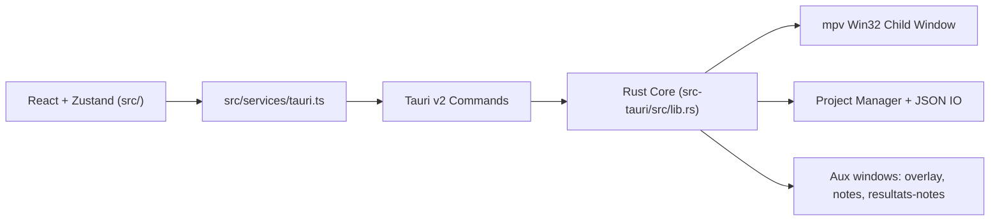

<!-- LANG-SELECTOR:START -->
[Français](README.md) ·
**English** ·
[Español](README.es.md) ·
[日本語](README.ja.md) ·
[Русский](README.ru.md) ·
[中文](README.zh.md)
<!-- LANG-SELECTOR:END -->

# AMV Notation


**Windows-first** desktop application for judging **AMV** (Anime Music Video) contests: barème (scoring-grid) management, mpv video playback, multi-judge aggregation, and publishable result exports.

> **Documentation note** — the `.github/copilot` folder and `.github/copilot-instructions.md` file do not exist in the repository. This README is built from `AGENTS.md`, `CLAUDE.md`, `package.json`, `src-tauri/Cargo.toml`, and `src-tauri/tauri.conf.json`.

## Project description

- **Name**: AMV Notation
- **Version**: `V1`
- **Identifier**: `com.amvnotation.desktop`
- **Purpose**: score AMV clips in a judge workflow, from video import to final export (tables, posters, judge notes).
- **Target platform**: Windows desktop (Tauri v2 + Win32 integration for the mpv player).

## Technology stack

| Area | Technologies |
|------|--------------|
| **Desktop shell** | Tauri `2.10.3`, `tauri-build 2.5.6`, `@tauri-apps/cli 2.10.1` |
| **Frontend** | React `19.2.0`, TypeScript `~5.9.3`, Vite `^7.2.4`, Zustand `^5.0.11`, Zod `^4.3.6`, Tailwind CSS `^4.3.0`, React Hook Form `^7.71.1`, Motion `^12.33.0` |
| **Backend** | Rust edition `2021`, rust-version `1.77.2` |
| **Tauri plugins** | `tauri-plugin-dialog 2.7.0`, `tauri-plugin-fs 2.5.0`, `tauri-plugin-opener 2.4.0` (+ matching `^2.x` JS packages) |
| **Video** | mpv via `libmpv-2.dll` (dynamically loaded through `libloading`) + FFmpeg/ffprobe helpers |
| **Export** | `jspdf`, `pdf-lib`, `html2canvas` |
| **Runtime i18n** | French, English, Japanese, Russian, Chinese, Spanish |

## Architecture

Hybrid architecture: multi-window React on the UI side, Rust/Tauri on the native runtime side.



Key invariants:

- React components **never** call `invoke()` directly; they go through `src/services/tauri.ts`;
- IPC/plugin permissions live in `src-tauri/capabilities/default.json`;
- every Tauri command must be registered in `tauri::generate_handler![]` (`src-tauri/src/lib.rs`);
- the overlay and detached windows are driven through dedicated Tauri events;
- mpv renders into a Win32 child window layered over the webview (not in the DOM); geometry is computed on the frontend and sent to the backend.

### Zustand stores

- `useProjectStore` — project, clips, current index, imported judges, dirty flag, deletion history;
- `usePlayerStore` — playback state, loaded file, tracks, fullscreen/detached;
- `useNotationStore` — notes, history, current barème, available barèmes;
- `useUIStore` — active tab, notation layout, theme, accent, language, zoom, shortcuts, modals;
- `useClipDeletionStore` — clip deletion confirmation flow.

## Getting started

### Prerequisites

- Node.js `>=18`
- Rust `>=1.77.2`
- Windows + WebView2 + MSVC toolchain (primary build path)
- `libmpv-2.dll` in the project root for video playback in dev — download from [mpv.io](https://mpv.io/) (Windows builds: `mpv-dev-x86_64`, `libmpv` archive)

### Installation

```bash
npm install
```

### Running

```bash
# Frontend only (Vite)
npm run dev

# Full desktop app (Vite + Tauri)
npm run tauri dev
```

### Build

```bash
# Frontend build TS + Vite
npm run build

# Debug desktop validation without bundle (recommended Windows/MSVC path)
npm run tauri -- build --debug --no-bundle

# Full desktop build
npm run tauri build
```

> **WSL/Linux note**: `cargo check` inside `src-tauri` may fail without the GTK/WebKit/Pango system dependencies. The primary target is Windows/MSVC — prefer `npm run tauri -- build --debug --no-bundle` to validate the desktop.

## Project structure

```text
src/
  main.tsx                    # Main window
  overlay-entry.tsx           # Fullscreen / detached overlay
  notes-entry.tsx             # Detached notes window
  resultats-notes-entry.tsx   # Detached judge-notes window
  components/                 # UI, interfaces, player, layout, settings
  hooks/                      # Player, polling, autosave, shortcuts
  services/tauri.ts           # Single Tauri API façade
  services/tauri_api/         # Domain-typed modules
  store/                      # Zustand stores
  i18n/                       # Seed + locales
  utils/                      # Scoring, results, theme, shortcuts

src-tauri/
  tauri.conf.json
  capabilities/default.json
  src/
    lib.rs                    # Tauri builder + command registration
    main.rs                   # Thin entry into run()
    app_windows.rs            # Auxiliary windows lifecycle
    state.rs                  # AppState mpv/window
    player/                   # mpv FFI, wrapper, Win32 window, commands
    project/                  # Project/settings/barèmes manager
    video/import.rs           # Video scan
```

## Key features

- end-to-end AMV judging workflow (project creation → scoring → results → export);
- `spreadsheet`, `notation` (comments), and `dual` (spreadsheet + detached notes) notation modes;
- video-less workflow (participants entered manually, files attached later);
- embedded mpv player: play/pause, seek, audio/subtitle tracks, fullscreen, detached window, AB-loop, screenshot, frame-step;
- detached notes and detached judge-notes via dedicated event bridges;
- judge notation import/export and multi-judge aggregation;
- rich exports: PNG, PDF, JSON, HTML/CSS, Discord previews;
- preferences persisted and broadcast across windows: theme, accent, language, shortcuts, thumbnails, confirmations.

## Development workflow

- Dev loop:
  - `npm run dev` for the UI only;
  - `npm run tauri dev` for the full desktop app.
- Pre-merge/release checks:
  - `npm run lint`
  - `npm run i18n:sync` (after adding UI text)
  - `npm run build`
  - `npm run tauri -- info`
  - `npm run tauri -- build --debug --no-bundle`
- The branching strategy is not explicitly documented in the repository (default branch: `master`).

## Coding standards

- modular, readable, testable code; avoid monolithic files;
- strict TypeScript, explicit names, single-responsibility components/hooks;
- Tauri v2: use `@tauri-apps/api/core|event|window` + official v2 plugins. **Do not** reintroduce v1 APIs (`@tauri-apps/api/tauri|dialog|fs`);
- all frontend IPC goes through `src/services/tauri.ts` — no direct `invoke()` in components;
- any new Tauri API/plugin comes with an update to `src-tauri/capabilities/default.json` in the same change;
- any new visible UI string goes through `useI18n().t(...)`; config-driven labels live in `src/i18n/seed.ts`. The source UI language is **French**.

## Tests & validation

The repo relies on build/lint validation rather than an automated test suite:

```bash
npm run lint
npm run i18n:sync
npm run build
npm run tauri -- info
npm run tauri -- build --debug --no-bundle
```

Notes:

- primary desktop target = Windows/MSVC;
- a direct `cargo check` under WSL/Linux is not representative if the Tauri system dependencies are missing.

## Contributing

- Follow the coding standards above and the architecture invariants (Tauri façade, capabilities, command registration, i18n).
- After any change to French UI text, run `npm run i18n:sync`, then review the sensitive translations (barème/judging vocabulary, preservation of `{path}`, `{error}` placeholders, JA/ZH layout fit).
- Leave zero avoidable errors/warnings in the touched area before finishing.
- Auxiliary windows (overlay, notes, resultats-notes) are separate HTML entry points — do not assume a single-window frontend.

## License

This project is released under the **GNU General Public License v3.0** (see [`LICENSE`](LICENSE)).
Official text: <https://www.gnu.org/licenses/gpl-3.0.html>
