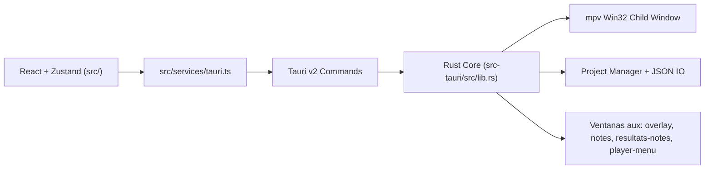

<!-- LANG-SELECTOR:START -->
[Français](README.md) ·
[English](README.en.md) ·
**Español** ·
[日本語](README.ja.md) ·
[Русский](README.ru.md) ·
[中文](README.zh.md)
<!-- LANG-SELECTOR:END -->

# AMV Notation


Aplicación de escritorio **Windows-first** para la calificación de concursos **AMV** (Anime Music Video): gestión de baremos, reproducción de vídeo con mpv, agregación multi-juez y exportaciones de resultados publicables.

## Descripción del proyecto

- **Nombre**: AMV Notation
- **Versión**: `V1`
- **Identificador**: `com.amvnotation.desktop`
- **Objetivo**: calificar clips AMV en un flujo de trabajo de juez, desde la importación de vídeos hasta la exportación final (tablas, carteles, notas de juez).
- **Plataforma objetivo**: escritorio Windows (Tauri v2 + integración Win32 para el reproductor mpv).

## Stack tecnológico

| Área | Tecnologías |
|------|-------------|
| **Desktop shell** | Tauri `2.10.3`, `tauri-build 2.5.6`, `@tauri-apps/cli 2.10.1` |
| **Frontend** | React `19.2.0`, TypeScript `~5.9.3`, Vite `^7.2.4`, Zustand `^5.0.11`, Zod `^4.3.6`, Tailwind CSS `^4.3.0`, React Hook Form `^7.71.1`, Motion `^12.33.0` |
| **Backend** | Rust edition `2021`, rust-version `1.77.2` |
| **Plugins Tauri** | `tauri-plugin-dialog 2.7.0`, `tauri-plugin-fs 2.5.0`, `tauri-plugin-opener 2.4.0` (+ paquetes JS `^2.x` correspondientes) |
| **Vídeo** | mpv vía `libmpv-2.dll` (carga dinámica con `libloading`) + helpers FFmpeg/ffprobe |
| **Exportación** | `jspdf`, `pdf-lib`, `html2canvas` |
| **i18n en tiempo de ejecución** | francés, inglés, japonés, ruso, chino, español |

## Arquitectura

Arquitectura híbrida: React multiventana en la UI, Rust/Tauri en el runtime nativo.



El frontend es multiventana: 5 puntos de entrada HTML (`index.html`, `overlay.html`, `notes.html`, `resultats-notes.html`, `player-menu.html`) declarados en `vite.config.ts` (`rollupOptions.input`).

Invariantes importantes:

- los componentes React **nunca** llaman a `invoke()` directamente; pasan por `src/services/tauri.ts`;
- los permisos IPC/plugins están en `src-tauri/capabilities/default.json`;
- todo comando Tauri debe registrarse en `tauri::generate_handler![]` (`src-tauri/src/lib.rs`);
- el overlay y las ventanas separadas se controlan mediante eventos Tauri dedicados;
- mpv se renderiza en una ventana hija Win32 superpuesta a la webview (no en el DOM); la geometría se calcula en el frontend y se envía al backend.

### Stores Zustand

- `useProjectStore` — proyecto, clips, índice actual, jueces importados, flag dirty, historial de eliminación;
- `usePlayerStore` — estado de reproducción, archivo cargado, pistas, fullscreen/separado;
- `useNotationStore` — notas, historial, baremo actual, baremos disponibles;
- `useUIStore` — pestaña activa, layout de notación, tema, acento, idioma, zoom, atajos, modales;
- `useClipDeletionStore` — flujo de confirmación de eliminación de clip;
- `useAppUpdateStore` — comprobación de actualizaciones vía releases de GitHub; actualización automática integrada y firmada (tauri-plugin-updater) descargada e instalada desde la aplicación.

## Primeros pasos

### Requisitos previos

- Node.js `>=18`
- Rust `>=1.77.2`
- Windows + WebView2 + toolchain MSVC (vía de build principal)
- `libmpv-2.dll` en la raíz del proyecto para la reproducción de vídeo en dev — descargar desde [mpv.io](https://mpv.io/) (builds Windows: `mpv-dev-x86_64`, archivo `libmpv`)

### Instalación

```bash
npm install
```

### Ejecución

```bash
# Solo frontend (Vite)
npm run dev

# App de escritorio completa (Vite + Tauri)
npm run tauri dev
```

### Build

```bash
# Build frontend TS + Vite
npm run build

# Validación desktop debug sin bundle (vía recomendada Windows/MSVC)
npm run tauri -- build --debug --no-bundle

# Build desktop completo
npm run tauri build
```

> **Nota WSL/Linux**: `cargo check` dentro de `src-tauri` puede fallar sin las dependencias de sistema GTK/WebKit/Pango. El objetivo principal es Windows/MSVC — preferir `npm run tauri -- build --debug --no-bundle` para validar el escritorio.

## Estructura del proyecto

```text
src/
  main.tsx                    # Ventana principal
  overlay-entry.tsx           # Overlay fullscreen / separado
  notes-entry.tsx             # Ventana de notas separada
  resultats-notes-entry.tsx   # Ventana de notas de jueces separada
  player-menu-entry.tsx       # Menú contextual del player (ventana separada)
  components/                 # UI, interfaces, player, layout, settings
  hooks/                      # Player, polling, autosave, atajos
  services/tauri.ts           # Fachada única de la API Tauri
  services/tauri_api/         # Módulos tipados por dominio
  store/                      # Stores Zustand
  i18n/                       # Seed + locales
  utils/                      # Scoring, resultados, tema, atajos

src-tauri/
  tauri.conf.json
  capabilities/default.json
  src/
    lib.rs                    # Builder Tauri + registro de comandos
    main.rs                   # Entrada fina hacia run()
    app_windows.rs            # Lifecycle de las ventanas auxiliares
    state.rs                  # AppState mpv/window
    player/                   # FFI mpv, wrapper, ventana Win32, commands
    project/                  # Manager de proyecto/settings/baremos
    video/import.rs           # Escaneo de vídeos
```

## Funcionalidades clave

- flujo de calificación AMV de extremo a extremo (creación de proyecto → notación → resultados → exportación);
- modos de notación `spreadsheet`, `notation` (comentarios) y `dual` (tabla + notas separadas);
- flujo sin vídeo (participantes introducidos manualmente, archivos adjuntados más tarde);
- reproductor mpv embebido: play/pause, seek, pistas de audio/subtítulos, fullscreen, ventana separada, AB-loop, captura, frame-step;
- notas separadas y notas de jueces separadas mediante puentes de eventos dedicados;
- importación/exportación de notaciones de jueces y agregación multi-juez;
- exportaciones ricas: PNG, PDF, JSON, HTML/CSS, previsualizaciones de Discord;
- preferencias persistidas y difundidas entre ventanas: tema, acento, idioma, atajos, miniaturas, confirmaciones;
- menú contextual del player separado (ventana `player-menu`);
- actualización automática integrada: aparece un logo azul «Actualizar» en la cabecera cuando hay una nueva versión firmada; al hacer clic se guarda el proyecto, se descarga, se instala y se reinicia la aplicación.

## Flujo de desarrollo

- Bucle de dev:
  - `npm run dev` para la UI sola;
  - `npm run tauri dev` para la app de escritorio completa.
- Comprobaciones antes de merge/release:
  - `npm run lint`
  - `npm run i18n:sync` (tras añadir texto de UI)
  - `npm run build`
  - `npm run tauri -- info`
  - `npm run tauri -- build --debug --no-bundle`
- La estrategia de ramas no está documentada explícitamente en el repositorio (rama por defecto: `master`).

## Convenciones de código

- código modular, legible, testeable; evitar archivos monolíticos;
- TypeScript estricto, nombres explícitos, componentes/hooks de responsabilidad única;
- Tauri v2: usar `@tauri-apps/api/core|event|window` + plugins oficiales v2. **No** reintroducir las API v1 (`@tauri-apps/api/tauri|dialog|fs`);
- toda IPC del frontend pasa por `src/services/tauri.ts` — sin `invoke()` directo en los componentes;
- toda nueva API/plugin Tauri se acompaña de una actualización de `src-tauri/capabilities/default.json` en el mismo cambio;
- toda nueva string de UI visible pasa por `useI18n().t(...)`; las etiquetas config-driven van en `src/i18n/seed.ts`. El idioma fuente de la UI es el **francés**.

## Tests y validación

El repositorio se apoya en validación por build/lint en vez de una suite de tests automatizados:

```bash
npm run lint
npm run i18n:sync
npm run build
npm run tauri -- info
npm run tauri -- build --debug --no-bundle
```

Notas:

- objetivo desktop principal = Windows/MSVC;
- un `cargo check` directo bajo WSL/Linux no es representativo si faltan las dependencias de sistema de Tauri.

## Contribución

- Seguir las convenciones de código anteriores y los invariantes de arquitectura (fachada Tauri, capabilities, registro de comandos, i18n).
- Tras cualquier cambio en texto de UI en francés, ejecutar `npm run i18n:sync` y luego revisar las traducciones sensibles (vocabulario de baremo/jurado, preservación de los placeholders `{path}`, `{error}`, ajuste de maquetación JA/ZH).
- Dejar cero errores/advertencias evitables en la zona tocada antes de terminar.
- Las ventanas auxiliares (overlay, notes, resultats-notes) son puntos de entrada HTML separados — no asumir un frontend de una sola ventana.

## Licencia

Este proyecto se publica bajo la licencia **GNU General Public License v3.0** (ver [`LICENSE`](LICENSE)).
Texto oficial: <https://www.gnu.org/licenses/gpl-3.0.html>
