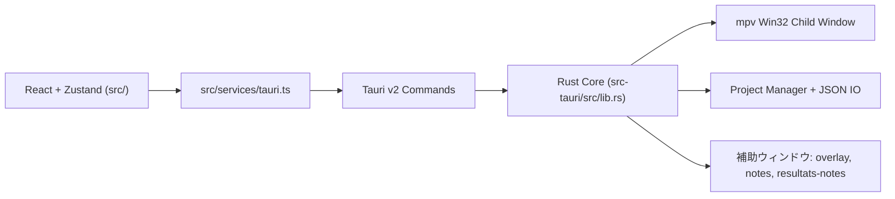

<!-- LANG-SELECTOR:START -->
[Français](README.md) ·
[English](README.en.md) ·
[Español](README.es.md) ·
**日本語** ·
[Русский](README.ru.md) ·
[中文](README.zh.md)
<!-- LANG-SELECTOR:END -->

# AMV Notation


**AMV**（アニメミュージックビデオ）コンテストの審査向け **Windows-first** デスクトップアプリ。評価基準（barème）の管理、mpv による動画再生、複数審査員の集計、公開可能な結果のエクスポートに対応します。

> **ドキュメントに関する注記** — リポジトリに `.github/copilot` フォルダと `.github/copilot-instructions.md` ファイルは存在しません。この README は `AGENTS.md`、`CLAUDE.md`、`package.json`、`src-tauri/Cargo.toml`、`src-tauri/tauri.conf.json` から作成されています。

## プロジェクト概要

- **名称**: AMV Notation
- **バージョン**: `V1`
- **識別子**: `com.amvnotation.desktop`
- **目的**: 審査員のワークフローで AMV クリップを採点する。動画のインポートから最終エクスポート（表、ポスター、審査員ノート）まで。
- **対象プラットフォーム**: Windows デスクトップ（Tauri v2 + mpv プレーヤー用の Win32 連携）。

## 技術スタック

| 分野 | 技術 |
|------|------|
| **デスクトップシェル** | Tauri `2.10.3`、`tauri-build 2.5.6`、`@tauri-apps/cli 2.10.1` |
| **フロントエンド** | React `19.2.0`、TypeScript `~5.9.3`、Vite `^7.2.4`、Zustand `^5.0.11`、Zod `^4.3.6`、Tailwind CSS `^4.3.0`、React Hook Form `^7.71.1`、Motion `^12.33.0` |
| **バックエンド** | Rust edition `2021`、rust-version `1.77.2` |
| **Tauri プラグイン** | `tauri-plugin-dialog 2.7.0`、`tauri-plugin-fs 2.5.0`、`tauri-plugin-opener 2.4.0`（対応する `^2.x` の JS パッケージを含む） |
| **動画** | `libmpv-2.dll` 経由の mpv（`libloading` による動的ロード）+ FFmpeg/ffprobe ヘルパー |
| **エクスポート** | `jspdf`、`pdf-lib`、`html2canvas` |
| **ランタイム i18n** | フランス語、英語、日本語、ロシア語、中国語、スペイン語 |

## アーキテクチャ

ハイブリッド構成: UI 側はマルチウィンドウの React、ネイティブランタイム側は Rust/Tauri。



重要な不変条件:

- React コンポーネントは `invoke()` を直接呼び出さない。必ず `src/services/tauri.ts` を経由する。
- IPC/プラグインの権限は `src-tauri/capabilities/default.json` で管理する。
- すべての Tauri コマンドは `tauri::generate_handler![]`（`src-tauri/src/lib.rs`）に登録する。
- オーバーレイと分離ウィンドウは専用の Tauri イベントで制御する。
- mpv は webview に重ねた Win32 子ウィンドウに描画される（DOM 内ではない）。ジオメトリはフロントエンドで計算してバックエンドに送る。

### Zustand ストア

- `useProjectStore` — プロジェクト、クリップ、現在のインデックス、インポート済み審査員、dirty フラグ、削除履歴。
- `usePlayerStore` — 再生状態、読み込み済みファイル、トラック、フルスクリーン/分離状態。
- `useNotationStore` — ノート、履歴、現在の barème、利用可能な barème。
- `useUIStore` — アクティブタブ、採点レイアウト、テーマ、アクセント、言語、ズーム、ショートカット、モーダル。
- `useClipDeletionStore` — クリップ削除の確認フロー。

## はじめに

### 前提条件

- Node.js `>=18`
- Rust `>=1.77.2`
- Windows + WebView2 + MSVC ツールチェーン（主要なビルド経路）
- 開発時の動画再生には、プロジェクトルートに `libmpv-2.dll`

### インストール

```bash
npm install
```

### 起動

```bash
# フロントエンドのみ (Vite)
npm run dev

# デスクトップアプリ全体 (Vite + Tauri)
npm run tauri dev
```

### ビルド

```bash
# フロントエンドビルド TS + Vite
npm run build

# バンドルなしのデバッグデスクトップ検証（推奨される Windows/MSVC 経路）
npm run tauri -- build --debug --no-bundle

# デスクトップ完全ビルド
npm run tauri build
```

> **WSL/Linux に関する注記**: `src-tauri` 内の `cargo check` は、GTK/WebKit/Pango のシステム依存関係がないと失敗することがあります。主要ターゲットは Windows/MSVC です。デスクトップの検証には `npm run tauri -- build --debug --no-bundle` を推奨します。

## プロジェクト構成

```text
src/
  main.tsx                    # メインウィンドウ
  overlay-entry.tsx           # フルスクリーン / 分離オーバーレイ
  notes-entry.tsx             # 分離ノートウィンドウ
  resultats-notes-entry.tsx   # 分離審査員ノートウィンドウ
  components/                 # UI、インターフェース、player、layout、settings
  hooks/                      # Player、polling、autosave、ショートカット
  services/tauri.ts           # Tauri API の単一ファサード
  services/tauri_api/         # ドメイン別の型付きモジュール
  store/                      # Zustand ストア
  i18n/                       # Seed + locales
  utils/                      # 採点、結果、テーマ、ショートカット

src-tauri/
  tauri.conf.json
  capabilities/default.json
  src/
    lib.rs                    # Tauri ビルダー + コマンド登録
    main.rs                   # run() への薄いエントリ
    app_windows.rs            # 補助ウィンドウのライフサイクル
    state.rs                  # AppState mpv/window
    player/                   # mpv FFI、ラッパー、Win32 ウィンドウ、commands
    project/                  # プロジェクト/設定/barème マネージャー
    video/import.rs           # 動画スキャン
```

## 主な機能

- エンドツーエンドの AMV 審査ワークフロー（プロジェクト作成 → 採点 → 結果 → エクスポート）。
- 採点モード `spreadsheet`、`notation`（コメント）、`dual`（表 + 分離ノート）。
- 動画なしのワークフロー（参加者を手動入力し、後でファイルを紐付け）。
- 組み込み mpv プレーヤー: 再生/一時停止、シーク、音声/字幕トラック、フルスクリーン、分離ウィンドウ、AB ループ、スクリーンショット、フレームステップ。
- 専用イベントブリッジによる分離ノートおよび分離審査員ノート。
- 審査員採点のインポート/エクスポートと複数審査員の集計。
- 充実したエクスポート: PNG、PDF、JSON、HTML/CSS、Discord プレビュー。
- ウィンドウ間で永続化・共有される設定: テーマ、アクセント、言語、ショートカット、サムネイル、確認ダイアログ。

## 開発ワークフロー

- 開発ループ:
  - UI のみは `npm run dev`。
  - デスクトップアプリ全体は `npm run tauri dev`。
- マージ/リリース前のチェック:
  - `npm run lint`
  - `npm run i18n:sync`（UI テキスト追加後）
  - `npm run build`
  - `npm run tauri -- info`
  - `npm run tauri -- build --debug --no-bundle`
- ブランチ戦略はリポジトリに明示的に記載されていません（デフォルトブランチ: `master`）。

## コーディング規約

- モジュール化された、読みやすく、テスト可能なコード。モノリシックなファイルを避ける。
- 厳格な TypeScript、明示的な命名、単一責任のコンポーネント/フック。
- Tauri v2: `@tauri-apps/api/core|event|window` と公式 v2 プラグインを使う。v1 API（`@tauri-apps/api/tauri|dialog|fs`）を**再導入しない**。
- フロントエンドのすべての IPC は `src/services/tauri.ts` を経由する。コンポーネントで直接 `invoke()` を呼ばない。
- 新しい Tauri API/プラグインを使う場合は、同じ変更で `src-tauri/capabilities/default.json` を更新する。
- 新しい可視 UI 文字列はすべて `useI18n().t(...)` を通す。config 駆動のラベルは `src/i18n/seed.ts` に置く。UI のソース言語は**フランス語**。

## テストと検証

このリポジトリは自動テストスイートではなく、ビルド/lint による検証に依存しています:

```bash
npm run lint
npm run i18n:sync
npm run build
npm run tauri -- info
npm run tauri -- build --debug --no-bundle
```

注記:

- 主要なデスクトップターゲット = Windows/MSVC。
- Tauri のシステム依存関係が欠けている場合、WSL/Linux での直接の `cargo check` は代表的ではありません。

## コントリビューション

- 上記のコーディング規約とアーキテクチャの不変条件（Tauri ファサード、capabilities、コマンド登録、i18n）に従ってください。
- フランス語の UI テキストを変更したら `npm run i18n:sync` を実行し、機微な翻訳（barème/審査の語彙、`{path}`・`{error}` プレースホルダーの保持、JA/ZH のレイアウト適合）を見直してください。
- 完了前に、触れた箇所で回避可能なエラー/警告をゼロにしてください。
- 補助ウィンドウ（overlay、notes、resultats-notes）は別々の HTML エントリポイントです。単一ウィンドウのフロントエンドだと仮定しないでください。

## ライセンス

本プロジェクトは **GNU General Public License v3.0**（[`LICENSE`](LICENSE) を参照）で公開されています。
公式テキスト: <https://www.gnu.org/licenses/gpl-3.0.html>
