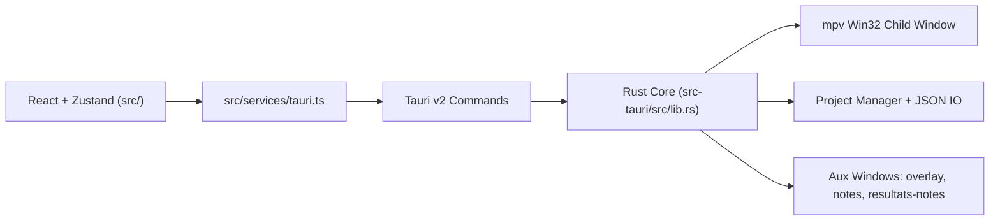

# AMV Notation


Application desktop Windows-first pour notation de concours AMV: gestion barèmes, lecture vidéo mpv, agrégation multi-juges, exports résultats publiables.

> Note documentation: dossier `.github/copilot` et fichier `.github/copilot-instructions.md` absents dans dépôt. README construit depuis `AGENTS.md`, `CLAUDE.md`, `package.json`, `src-tauri/Cargo.toml`, `src-tauri/tauri.conf.json`.

## Project Name and Description

- **Nom**: AMV Notation
- **Version logicielle**: `0.9.0`
- **But principal**: noter clips AMV dans workflow juge, de import vidéos jusqu’à export final (tableaux, affiches, notes juge).
- **Plateforme cible**: desktop Windows (Tauri v2 + intégration Win32 pour player mpv).

## Technology Stack

- **Desktop shell**: Tauri `2.10.3`, `tauri-build 2.5.6`, `@tauri-apps/cli 2.10.1`
- **Frontend**: React `19.2.0`, TypeScript `~5.9.3`, Vite `^7.2.4`, Zustand `^5.0.11`, Zod `^4.3.6`, Tailwind CSS `^3.4.19`
- **Backend**: Rust edition `2021`, rust-version `1.77.2`
- **Tauri plugins**: `tauri-plugin-dialog 2.7.0`, `tauri-plugin-fs 2.5.0`, `@tauri-apps/plugin-dialog ^2.7.0`, `@tauri-apps/plugin-fs ^2.5.0`
- **Vidéo**: mpv via `libmpv-2.dll` (chargement dynamique) + FFmpeg/ffprobe helpers
- **i18n runtime**: français, anglais, japonais, russe, chinois, espagnol

## Project Architecture

Architecture hybride: React multi-fenêtres côté UI, Rust/Tauri côté runtime natif.



Invariants importants:
- composants React ne doivent pas appeler `invoke()` direct; passer par `src/services/tauri.ts`
- permissions IPC/plugins gérées dans `src-tauri/capabilities/default.json`
- overlay et fenêtres détachées pilotés via events Tauri dédiés

## Getting Started

### Prérequis

- Node.js `>=18`
- Rust `>=1.77.2`
- Windows + WebView2 + toolchain MSVC (chemin build principal)
- `libmpv-2.dll` dans racine projet pour lecture vidéo en dev

### Installation

```bash
npm install
```

### Lancement

```bash
# Frontend seul
npm run dev

# App desktop Tauri
npm run tauri dev
```

### Build

```bash
# Build frontend TS + Vite
npm run build

# Validation desktop debug sans bundle
npm run tauri -- build --debug --no-bundle

# Build desktop complet
npm run tauri build
```

Note WSL/Linux: `cargo check` dans `src-tauri` peut échouer sans dépendances GTK/WebKit/Pango. Validation recommandée pour cible Windows: `npm run tauri -- build --debug --no-bundle`.

## Project Structure

```text
src/
  main.tsx                    # Fenêtre principale
  overlay-entry.tsx           # Overlay fullscreen / détaché
  notes-entry.tsx             # Fenêtre notes détachée
  resultats-notes-entry.tsx   # Fenêtre notes juges détachée
  components/                 # UI, interfaces, player, layout, settings
  hooks/                      # Player, polling, autosave, shortcuts
  services/tauri.ts           # Façade unique Tauri API
  services/tauri_api/         # Modules typed par domaine
  store/                      # Stores Zustand
  i18n/                       # Seed + locales
  utils/                      # Scoring, résultats, thème, raccourcis

src-tauri/
  tauri.conf.json
  capabilities/default.json
  src/
    lib.rs                    # Builder Tauri + command registration
    main.rs                   # Entrée fine vers run()
    app_windows.rs            # Lifecycle fenêtres auxiliaires
    state.rs                  # AppState mpv/window
    player/                   # FFI mpv, wrapper, window Win32, commands
    project/                  # Manager projet/settings/barèmes
    video/import.rs           # Scan vidéos
```

## Key Features

- workflow de notation AMV de bout en bout (création projet -> notation -> résultats -> export)
- modes notation `spreadsheet`, `notation`, `dual`
- support workflow sans vidéo (participants manuels puis rattachement plus tard)
- player mpv embarqué: play/pause, seek, tracks audio/sous-titres, fullscreen, fenêtre détachée
- notes détachées et notes juges détachées via bridges events dédiés
- import/export notations juges et agrégation multi-juges
- exports riches: PNG, PDF, JSON, HTML/CSS, Excel, aperçus Discord
- préférences persistées: thème, accent, langue, raccourcis, miniatures, confirmations

## Development Workflow

- dev loop standard:
  - `npm run dev` pour UI
  - `npm run tauri dev` pour app desktop complète
- checks avant merge/release:
  - `npm run lint`
  - `npm run i18n:sync` après ajout texte UI
  - `npm run build`
  - `npm run tauri -- info`
  - `npm run tauri -- build --debug --no-bundle`
- stratégie branches non documentée explicitement dans dépôt

## Coding Standards

- code modulaire, lisible, testable; éviter fichiers monolithiques
- TypeScript strict, noms explicites, composants/hooks responsabilité unique
- pour Tauri v2:
  - utiliser `@tauri-apps/api/core|event|window` + plugins officiels v2
  - ne pas réintroduire APIs v1 (`@tauri-apps/api/tauri|dialog|fs`)
- toute IPC frontend via `src/services/tauri.ts`, pas d’`invoke()` direct dans composants
- toute nouvelle API/plugin Tauri doit être accompagnée mise à jour `src-tauri/capabilities/default.json`
- toute nouvelle string UI doit passer via `useI18n().t(...)`

## Testing

Approche validation repo:

```bash
npm run lint
npm run i18n:sync
npm run build
npm run tauri -- info
npm run tauri -- build --debug --no-bundle
```

Notes:
- cible desktop principale = Windows/MSVC
- `cargo check` direct sous WSL/Linux non représentatif si dépendances système Tauri manquantes

## License

Ce projet est placé sous licence **CC0 1.0 Universal** (dédicace au domaine public).
Texte officiel: https://creativecommons.org/publicdomain/zero/1.0/
