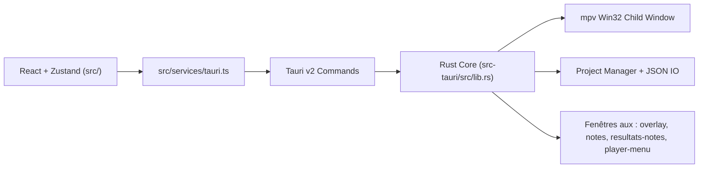

<!-- LANG-SELECTOR:START -->
**Français** ·
[English](README.en.md) ·
[Español](README.es.md) ·
[日本語](README.ja.md) ·
[Русский](README.ru.md) ·
[中文](README.zh.md)
<!-- LANG-SELECTOR:END -->

# AMV Notation


Application desktop **Windows-first** pour la notation de concours **AMV** (Anime Music Video) : gestion de barèmes, lecture vidéo via mpv, agrégation multi-juges et exports de résultats publiables.

## Description du projet

- **Nom** : AMV Notation
- **Version** : `V1`
- **Identifiant** : `com.amvnotation.desktop`
- **But** : noter des clips AMV dans un workflow de juge, de l'import des vidéos jusqu'à l'export final (tableaux, affiches, notes de juge).
- **Plateforme cible** : desktop Windows (Tauri v2 + intégration Win32 pour le player mpv).

## Stack technique

| Domaine | Technologies |
|---------|--------------|
| **Desktop shell** | Tauri `2.10.3`, `tauri-build 2.5.6`, `@tauri-apps/cli 2.10.1` |
| **Frontend** | React `19.2.0`, TypeScript `~5.9.3`, Vite `^7.2.4`, Zustand `^5.0.11`, Zod `^4.3.6`, Tailwind CSS `^4.3.0`, React Hook Form `^7.71.1`, Motion `^12.33.0` |
| **Backend** | Rust edition `2021`, rust-version `1.77.2` |
| **Plugins Tauri** | `tauri-plugin-dialog 2.7.0`, `tauri-plugin-fs 2.5.0`, `tauri-plugin-opener 2.4.0` (+ packages JS `^2.x` correspondants) |
| **Vidéo** | mpv via `libmpv-2.dll` (chargement dynamique par `libloading`) + helpers FFmpeg/ffprobe |
| **Export** | `jspdf`, `pdf-lib`, `html2canvas` |
| **i18n runtime** | français, anglais, japonais, russe, chinois, espagnol |

## Architecture

Architecture hybride : React multi-fenêtres côté UI, Rust/Tauri côté runtime natif.



Le frontend est multi-fenêtres : 5 points d'entrée HTML (`index.html`, `overlay.html`, `notes.html`, `resultats-notes.html`, `player-menu.html`) déclarés dans `vite.config.ts` (`rollupOptions.input`).

Invariants importants :

- les composants React n'appellent **jamais** `invoke()` directement ; ils passent par `src/services/tauri.ts` ;
- les permissions IPC/plugins sont gérées dans `src-tauri/capabilities/default.json` ;
- toute commande Tauri doit être enregistrée dans `tauri::generate_handler![]` (`src-tauri/src/lib.rs`) ;
- l'overlay et les fenêtres détachées sont pilotés via des events Tauri dédiés ;
- mpv s'affiche dans une fenêtre enfant Win32 superposée à la webview (pas dans le DOM) ; la géométrie est calculée côté frontend puis envoyée au backend.

### Stores Zustand

- `useProjectStore` — projet, clips, index courant, juges importés, flag dirty, historique de suppression ;
- `usePlayerStore` — état de lecture, fichier chargé, pistes, fullscreen/détaché ;
- `useNotationStore` — notes, historique, barème courant, barèmes disponibles ;
- `useUIStore` — onglet actif, layout de notation, thème, accent, langue, zoom, raccourcis, modales ;
- `useClipDeletionStore` — flux de confirmation de suppression de clip ;
- `useAppUpdateStore` — vérification des mises à jour via les releases GitHub ; mise à jour automatique intégrée et signée (tauri-plugin-updater) téléchargée et installée depuis l'application.

## Démarrage

### Prérequis

- Node.js `>=18`
- Rust `>=1.77.2`
- Windows + WebView2 + toolchain MSVC (chemin de build principal)
- `libmpv-2.dll` à la racine du projet pour la lecture vidéo en dev — à télécharger depuis [mpv.io](https://mpv.io/) (builds Windows : `mpv-dev-x86_64`, archive `libmpv`)

### Installation

```bash
npm install
```

### Lancement

```bash
# Frontend seul (Vite)
npm run dev

# App desktop complète (Vite + Tauri)
npm run tauri dev
```

### Build

```bash
# Build frontend TS + Vite
npm run build

# Validation desktop debug sans bundle (chemin recommandé Windows/MSVC)
npm run tauri -- build --debug --no-bundle

# Build desktop complet
npm run tauri build
```

> **Note WSL/Linux** : `cargo check` dans `src-tauri` peut échouer sans les dépendances système GTK/WebKit/Pango. La cible principale est Windows/MSVC — préférer `npm run tauri -- build --debug --no-bundle` pour valider le desktop.

## Structure du projet

```text
src/
  main.tsx                    # Fenêtre principale
  overlay-entry.tsx           # Overlay fullscreen / détaché
  notes-entry.tsx             # Fenêtre notes détachée
  resultats-notes-entry.tsx   # Fenêtre notes juges détachée
  player-menu-entry.tsx       # Menu contextuel player (fenêtre détachée)
  components/                 # UI, interfaces, player, layout, settings
  hooks/                      # Player, polling, autosave, raccourcis
  services/tauri.ts           # Façade unique de l'API Tauri
  services/tauri_api/         # Modules typés par domaine
  store/                      # Stores Zustand
  i18n/                       # Seed + locales
  utils/                      # Scoring, résultats, thème, raccourcis

src-tauri/
  tauri.conf.json
  capabilities/default.json
  src/
    lib.rs                    # Builder Tauri + enregistrement des commandes
    main.rs                   # Entrée fine vers run()
    app_windows.rs            # Lifecycle des fenêtres auxiliaires
    state.rs                  # AppState mpv/window
    player/                   # FFI mpv, wrapper, fenêtre Win32, commands
    project/                  # Manager projet/settings/barèmes
    video/import.rs           # Scan des vidéos
```

## Fonctionnalités clés

- workflow de notation AMV de bout en bout (création projet → notation → résultats → export) ;
- modes de notation `spreadsheet`, `notation` (commentaires) et `dual` (tableur + notes détachées) ;
- workflow sans vidéo (participants saisis manuellement, rattachement des fichiers plus tard) ;
- player mpv embarqué : play/pause, seek, pistes audio/sous-titres, fullscreen, fenêtre détachée, AB-loop, screenshot, frame-step ;
- VU-mètre audio L/R en dB temps réel (filtre FFmpeg `astats`), activable à la demande : appliqué de façon paresseuse uniquement quand l'option est cochée, pour ne jamais sacrifier le son par défaut ;
- notes détachées et notes de juges détachées via bridges d'events dédiés ;
- import/export des notations de juges et agrégation multi-juges ;
- exports riches : PNG, PDF, JSON, HTML/CSS, aperçus Discord ;
- préférences persistées et diffusées entre fenêtres : thème, accent, langue, raccourcis, miniatures, confirmations ;
- menu contextuel player détaché (fenêtre `player-menu`) ;
- mise à jour automatique intégrée : un logo bleu « Mettre à jour » apparaît dans l'en-tête quand une nouvelle version signée est disponible ; le clic sauvegarde le projet, télécharge, installe et relance l'application.

## Workflow de développement

- Boucle de dev :
  - `npm run dev` pour l'UI seule ;
  - `npm run tauri dev` pour l'app desktop complète.
- Checks avant merge/release :
  - `npm run lint`
  - `npm run i18n:sync` (après ajout de texte UI)
  - `npm run build`
  - `npm run tauri -- info`
  - `npm run tauri -- build --debug --no-bundle`
- La stratégie de branches n'est pas documentée explicitement dans le dépôt (branche par défaut : `master`).

## Conventions de code

- code modulaire, lisible, testable ; éviter les fichiers monolithiques ;
- TypeScript strict, noms explicites, composants/hooks à responsabilité unique ;
- Tauri v2 : utiliser `@tauri-apps/api/core|event|window` + plugins officiels v2. **Ne pas** réintroduire les API v1 (`@tauri-apps/api/tauri|dialog|fs`) ;
- toute IPC frontend passe par `src/services/tauri.ts` — pas d'`invoke()` direct dans les composants ;
- toute nouvelle API/plugin Tauri s'accompagne d'une mise à jour de `src-tauri/capabilities/default.json` dans le même changement ;
- toute nouvelle string UI visible passe par `useI18n().t(...)` ; les labels config-driven vont dans `src/i18n/seed.ts`. La langue source de l'UI est le **français**.

## Tests & validation

Le dépôt s'appuie sur une validation par build/lint plutôt que sur une suite de tests automatisés :

```bash
npm run lint
npm run i18n:sync
npm run build
npm run tauri -- info
npm run tauri -- build --debug --no-bundle
```

Notes :

- cible desktop principale = Windows/MSVC ;
- `cargo check` direct sous WSL/Linux n'est pas représentatif si les dépendances système Tauri manquent.

## Contribution

- Respecter les conventions de code ci-dessus et les invariants d'architecture (façade Tauri, capabilities, enregistrement des commandes, i18n).
- Après toute modification de texte UI français, lancer `npm run i18n:sync` puis relire les traductions sensibles (vocabulaire barème/jugement, préservation des placeholders `{path}`, `{error}`, ajustement de mise en page JA/ZH).
- Laisser zéro erreur/warning évitable dans la zone touchée avant de finir.
- Les fenêtres auxiliaires (overlay, notes, resultats-notes) sont des points d'entrée HTML séparés — ne pas supposer un frontend mono-fenêtre.

## Historique des versions

- **1.0.4** — correctif mise à jour : suppression de l'erreur « Error opening file for writing… amv-notation.exe » (Abandonner/Recommencer/Ignorer) qui survenait pendant l'installation d'une mise à jour. Sur Windows, l'installeur NSIS redémarre déjà l'application (`/R`) ; l'app se contente désormais de se fermer pour libérer le binaire au lieu de relancer une seconde instance qui le verrouillait.
- **1.0.3** — correctif son : le build FFmpeg embarqué décode désormais **tous les codecs audio et vidéo natifs** (plus de `--disable-everything`, seuls encoders/muxers/devices/réseau restent désactivés). Corrige l'absence de son sur les masters ProRes/MOV en PCM big-endian (`pcm_s16be`) et tout autre codec non inclus dans le build amputé précédent. Décodeurs/demuxers/parsers complets ; encodeurs désactivés (lecture seule, screenshots préservés).
- **1.0.2** — correctif VU-mètre : le filtre audio `astats` n'est plus posé à l'initialisation de mpv (il pouvait échouer à se construire selon le format audio d'un clip et couper le son / éteindre le mètre sur certaines vidéos). Il est désormais appliqué de façon paresseuse et opt-in via `player_set_audio_meter`, donc le son est garanti par défaut et le VU-mètre fonctionne sur toutes les vidéos une fois activé. Build mpv/FFmpeg embarquant `astats`/`aformat`/`aresample`/`anull`.
- **1.0.1** — mise à jour automatique signée + logo bleu « Mettre à jour » dans l'en-tête.

## Licence

Projet placé sous licence **GNU General Public License v3.0** (voir [`LICENSE`](LICENSE)).
Texte officiel : <https://www.gnu.org/licenses/gpl-3.0.html>
