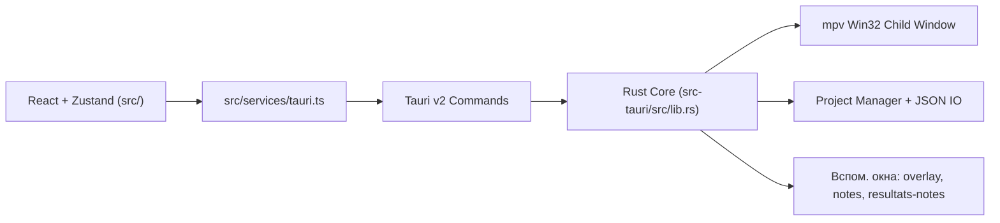

<!-- LANG-SELECTOR:START -->
[Français](README.md) ·
[English](README.en.md) ·
[Español](README.es.md) ·
[日本語](README.ja.md) ·
**Русский** ·
[中文](README.zh.md)
<!-- LANG-SELECTOR:END -->

# AMV Notation


Десктопное приложение **Windows-first** для судейства конкурсов **AMV** (Anime Music Video): управление баремами (системами оценивания), воспроизведение видео через mpv, агрегация оценок нескольких судей и экспорт публикуемых результатов.

> **Примечание о документации** — папка `.github/copilot` и файл `.github/copilot-instructions.md` в репозитории отсутствуют. Этот README построен на основе `AGENTS.md`, `CLAUDE.md`, `package.json`, `src-tauri/Cargo.toml` и `src-tauri/tauri.conf.json`.

## Описание проекта

- **Название**: AMV Notation
- **Версия**: `V1`
- **Идентификатор**: `com.amvnotation.desktop`
- **Назначение**: оценивать клипы AMV в рабочем процессе судьи, от импорта видео до итогового экспорта (таблицы, постеры, заметки судей).
- **Целевая платформа**: десктоп Windows (Tauri v2 + интеграция Win32 для плеера mpv).

## Технологический стек

| Область | Технологии |
|---------|------------|
| **Desktop shell** | Tauri `2.10.3`, `tauri-build 2.5.6`, `@tauri-apps/cli 2.10.1` |
| **Frontend** | React `19.2.0`, TypeScript `~5.9.3`, Vite `^7.2.4`, Zustand `^5.0.11`, Zod `^4.3.6`, Tailwind CSS `^4.3.0`, React Hook Form `^7.71.1`, Motion `^12.33.0` |
| **Backend** | Rust edition `2021`, rust-version `1.77.2` |
| **Плагины Tauri** | `tauri-plugin-dialog 2.7.0`, `tauri-plugin-fs 2.5.0`, `tauri-plugin-opener 2.4.0` (+ соответствующие JS-пакеты `^2.x`) |
| **Видео** | mpv через `libmpv-2.dll` (динамическая загрузка через `libloading`) + хелперы FFmpeg/ffprobe |
| **Экспорт** | `jspdf`, `pdf-lib`, `html2canvas` |
| **i18n в рантайме** | французский, английский, японский, русский, китайский, испанский |

## Архитектура

Гибридная архитектура: многооконный React на стороне UI, Rust/Tauri на стороне нативного рантайма.



Важные инварианты:

- компоненты React **никогда** не вызывают `invoke()` напрямую; они проходят через `src/services/tauri.ts`;
- разрешения IPC/плагинов находятся в `src-tauri/capabilities/default.json`;
- каждая команда Tauri должна быть зарегистрирована в `tauri::generate_handler![]` (`src-tauri/src/lib.rs`);
- оверлей и отсоединённые окна управляются через выделенные события Tauri;
- mpv отрисовывается в дочернем окне Win32 поверх webview (не в DOM); геометрия вычисляется во фронтенде и передаётся в бэкенд.

### Хранилища Zustand

- `useProjectStore` — проект, клипы, текущий индекс, импортированные судьи, флаг dirty, история удалений;
- `usePlayerStore` — состояние воспроизведения, загруженный файл, дорожки, полноэкранный/отсоединённый режим;
- `useNotationStore` — заметки, история, текущий barème, доступные barème;
- `useUIStore` — активная вкладка, раскладка оценивания, тема, акцент, язык, масштаб, горячие клавиши, модальные окна;
- `useClipDeletionStore` — поток подтверждения удаления клипа.

## Начало работы

### Требования

- Node.js `>=18`
- Rust `>=1.77.2`
- Windows + WebView2 + тулчейн MSVC (основной путь сборки)
- `libmpv-2.dll` в корне проекта для воспроизведения видео в dev-режиме

### Установка

```bash
npm install
```

### Запуск

```bash
# Только фронтенд (Vite)
npm run dev

# Полное десктопное приложение (Vite + Tauri)
npm run tauri dev
```

### Сборка

```bash
# Сборка фронтенда TS + Vite
npm run build

# Отладочная проверка десктопа без bundle (рекомендуемый путь Windows/MSVC)
npm run tauri -- build --debug --no-bundle

# Полная десктопная сборка
npm run tauri build
```

> **Примечание WSL/Linux**: `cargo check` внутри `src-tauri` может завершиться ошибкой без системных зависимостей GTK/WebKit/Pango. Основная цель — Windows/MSVC; для проверки десктопа предпочтительнее `npm run tauri -- build --debug --no-bundle`.

## Структура проекта

```text
src/
  main.tsx                    # Главное окно
  overlay-entry.tsx           # Полноэкранный / отсоединённый оверлей
  notes-entry.tsx             # Отсоединённое окно заметок
  resultats-notes-entry.tsx   # Отсоединённое окно заметок судей
  components/                 # UI, интерфейсы, player, layout, settings
  hooks/                      # Player, polling, autosave, горячие клавиши
  services/tauri.ts           # Единый фасад API Tauri
  services/tauri_api/         # Типизированные модули по доменам
  store/                      # Хранилища Zustand
  i18n/                       # Seed + locales
  utils/                      # Подсчёт очков, результаты, тема, горячие клавиши

src-tauri/
  tauri.conf.json
  capabilities/default.json
  src/
    lib.rs                    # Билдер Tauri + регистрация команд
    main.rs                   # Тонкая точка входа в run()
    app_windows.rs            # Жизненный цикл вспомогательных окон
    state.rs                  # AppState mpv/window
    player/                   # mpv FFI, обёртка, окно Win32, commands
    project/                  # Менеджер проекта/настроек/barème
    video/import.rs           # Сканирование видео
```

## Ключевые возможности

- сквозной рабочий процесс судейства AMV (создание проекта → оценивание → результаты → экспорт);
- режимы оценивания `spreadsheet`, `notation` (комментарии) и `dual` (таблица + отсоединённые заметки);
- рабочий процесс без видео (участники вводятся вручную, файлы прикрепляются позже);
- встроенный плеер mpv: воспроизведение/пауза, перемотка, аудио/субтитровые дорожки, полный экран, отсоединённое окно, AB-loop, скриншот, покадровый шаг;
- отсоединённые заметки и отсоединённые заметки судей через выделенные мосты событий;
- импорт/экспорт оценок судей и агрегация по нескольким судьям;
- богатый экспорт: PNG, PDF, JSON, HTML/CSS, превью для Discord;
- настройки сохраняются и транслируются между окнами: тема, акцент, язык, горячие клавиши, миниатюры, подтверждения.

## Процесс разработки

- Цикл разработки:
  - `npm run dev` — только UI;
  - `npm run tauri dev` — полное десктопное приложение.
- Проверки перед merge/release:
  - `npm run lint`
  - `npm run i18n:sync` (после добавления текста UI)
  - `npm run build`
  - `npm run tauri -- info`
  - `npm run tauri -- build --debug --no-bundle`
- Стратегия ветвления явно не задокументирована в репозитории (ветка по умолчанию: `master`).

## Стандарты кода

- модульный, читаемый, тестируемый код; избегать монолитных файлов;
- строгий TypeScript, явные имена, компоненты/хуки с единственной ответственностью;
- Tauri v2: использовать `@tauri-apps/api/core|event|window` + официальные плагины v2. **Не** возвращать API v1 (`@tauri-apps/api/tauri|dialog|fs`);
- весь IPC фронтенда проходит через `src/services/tauri.ts` — без прямого `invoke()` в компонентах;
- любой новый Tauri API/плагин сопровождается обновлением `src-tauri/capabilities/default.json` в том же изменении;
- любая новая видимая строка UI проходит через `useI18n().t(...)`; config-driven метки находятся в `src/i18n/seed.ts`. Исходный язык UI — **французский**.

## Тесты и валидация

Репозиторий полагается на валидацию через build/lint, а не на автоматический набор тестов:

```bash
npm run lint
npm run i18n:sync
npm run build
npm run tauri -- info
npm run tauri -- build --debug --no-bundle
```

Примечания:

- основная десктопная цель = Windows/MSVC;
- прямой `cargo check` под WSL/Linux нерепрезентативен, если отсутствуют системные зависимости Tauri.

## Участие в разработке

- Следуйте указанным выше стандартам кода и инвариантам архитектуры (фасад Tauri, capabilities, регистрация команд, i18n).
- После любого изменения текста UI на французском запустите `npm run i18n:sync`, затем проверьте чувствительные переводы (лексика barème/судейства, сохранение плейсхолдеров `{path}`, `{error}`, соответствие вёрстки JA/ZH).
- Перед завершением оставьте ноль устранимых ошибок/предупреждений в затронутой области.
- Вспомогательные окна (overlay, notes, resultats-notes) — это отдельные HTML-точки входа; не предполагайте однооконный фронтенд.

## Лицензия

Проект выпущен под лицензией **GNU General Public License v3.0** (см. [`LICENSE`](LICENSE)).
Официальный текст: <https://www.gnu.org/licenses/gpl-3.0.html>
