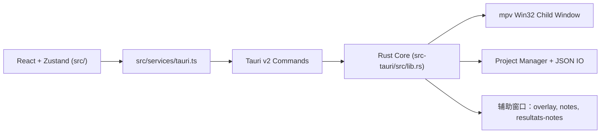

<!-- LANG-SELECTOR:START -->
[Français](README.md) ·
[English](README.en.md) ·
[Español](README.es.md) ·
[日本語](README.ja.md) ·
[Русский](README.ru.md) ·
**中文**
<!-- LANG-SELECTOR:END -->

# AMV Notation


面向 **AMV**（Anime Music Video，动画音乐视频）比赛评审的 **Windows 优先** 桌面应用：评分标准（barème）管理、通过 mpv 播放视频、多评委聚合，以及可发布的结果导出。

> **文档说明** — 仓库中不存在 `.github/copilot` 文件夹和 `.github/copilot-instructions.md` 文件。本 README 基于 `AGENTS.md`、`CLAUDE.md`、`package.json`、`src-tauri/Cargo.toml` 和 `src-tauri/tauri.conf.json` 构建。

## 项目说明

- **名称**：AMV Notation
- **版本**：`V1`
- **标识符**：`com.amvnotation.desktop`
- **目标**：在评委工作流中为 AMV 片段评分，从视频导入到最终导出（表格、海报、评委备注）。
- **目标平台**：Windows 桌面（Tauri v2 + 用于 mpv 播放器的 Win32 集成）。

## 技术栈

| 领域 | 技术 |
|------|------|
| **桌面外壳** | Tauri `2.10.3`、`tauri-build 2.5.6`、`@tauri-apps/cli 2.10.1` |
| **前端** | React `19.2.0`、TypeScript `~5.9.3`、Vite `^7.2.4`、Zustand `^5.0.11`、Zod `^4.3.6`、Tailwind CSS `^4.3.0`、React Hook Form `^7.71.1`、Motion `^12.33.0` |
| **后端** | Rust edition `2021`、rust-version `1.77.2` |
| **Tauri 插件** | `tauri-plugin-dialog 2.7.0`、`tauri-plugin-fs 2.5.0`、`tauri-plugin-opener 2.4.0`（以及对应的 `^2.x` JS 包） |
| **视频** | 通过 `libmpv-2.dll` 的 mpv（由 `libloading` 动态加载）+ FFmpeg/ffprobe 辅助工具 |
| **导出** | `jspdf`、`pdf-lib`、`html2canvas` |
| **运行时 i18n** | 法语、英语、日语、俄语、中文、西班牙语 |

## 架构

混合架构：UI 侧为多窗口 React，原生运行时侧为 Rust/Tauri。



重要不变量：

- React 组件**绝不**直接调用 `invoke()`，而是通过 `src/services/tauri.ts`；
- IPC/插件权限位于 `src-tauri/capabilities/default.json`；
- 每个 Tauri 命令都必须在 `tauri::generate_handler![]`（`src-tauri/src/lib.rs`）中注册；
- 浮层和分离窗口通过专用的 Tauri 事件驱动；
- mpv 渲染到叠加在 webview 之上的 Win32 子窗口中（而非 DOM）；几何信息在前端计算后发送到后端。

### Zustand 状态库

- `useProjectStore` — 项目、片段、当前索引、已导入评委、dirty 标志、删除历史；
- `usePlayerStore` — 播放状态、已加载文件、轨道、全屏/分离状态；
- `useNotationStore` — 备注、历史、当前 barème、可用 barème；
- `useUIStore` — 活动标签页、评分布局、主题、强调色、语言、缩放、快捷键、模态框；
- `useClipDeletionStore` — 片段删除确认流程。

## 快速开始

### 前置条件

- Node.js `>=18`
- Rust `>=1.77.2`
- Windows + WebView2 + MSVC 工具链（主要构建路径）
- 开发环境下视频播放需在项目根目录放置 `libmpv-2.dll`

### 安装

```bash
npm install
```

### 运行

```bash
# 仅前端 (Vite)
npm run dev

# 完整桌面应用 (Vite + Tauri)
npm run tauri dev
```

### 构建

```bash
# 前端构建 TS + Vite
npm run build

# 不打包的调试桌面验证（推荐的 Windows/MSVC 路径）
npm run tauri -- build --debug --no-bundle

# 完整桌面构建
npm run tauri build
```

> **WSL/Linux 说明**：在缺少 GTK/WebKit/Pango 系统依赖时，`src-tauri` 内的 `cargo check` 可能失败。主要目标为 Windows/MSVC——验证桌面时优先使用 `npm run tauri -- build --debug --no-bundle`。

## 项目结构

```text
src/
  main.tsx                    # 主窗口
  overlay-entry.tsx           # 全屏 / 分离浮层
  notes-entry.tsx             # 分离备注窗口
  resultats-notes-entry.tsx   # 分离评委备注窗口
  components/                 # UI、界面、player、layout、settings
  hooks/                      # Player、polling、autosave、快捷键
  services/tauri.ts           # Tauri API 的唯一门面
  services/tauri_api/         # 按领域类型化的模块
  store/                      # Zustand 状态库
  i18n/                       # Seed + locales
  utils/                      # 评分、结果、主题、快捷键

src-tauri/
  tauri.conf.json
  capabilities/default.json
  src/
    lib.rs                    # Tauri 构建器 + 命令注册
    main.rs                   # 指向 run() 的精简入口
    app_windows.rs            # 辅助窗口生命周期
    state.rs                  # AppState mpv/window
    player/                   # mpv FFI、包装器、Win32 窗口、commands
    project/                  # 项目/设置/barème 管理器
    video/import.rs           # 视频扫描
```

## 主要功能

- 端到端的 AMV 评审工作流（创建项目 → 评分 → 结果 → 导出）；
- 评分模式 `spreadsheet`、`notation`（评论）和 `dual`（表格 + 分离备注）；
- 无视频工作流（手动录入参赛者，稍后附加文件）；
- 内嵌 mpv 播放器：播放/暂停、定位、音频/字幕轨道、全屏、分离窗口、AB 循环、截图、逐帧步进；
- 通过专用事件桥的分离备注和分离评委备注；
- 评委评分的导入/导出与多评委聚合；
- 丰富的导出：PNG、PDF、JSON、HTML/CSS、Discord 预览；
- 在窗口间持久化并广播的偏好：主题、强调色、语言、快捷键、缩略图、确认项。

## 开发工作流

- 开发循环：
  - `npm run dev` 仅运行 UI；
  - `npm run tauri dev` 运行完整桌面应用。
- 合并/发布前检查：
  - `npm run lint`
  - `npm run i18n:sync`（添加 UI 文本后）
  - `npm run build`
  - `npm run tauri -- info`
  - `npm run tauri -- build --debug --no-bundle`
- 仓库未明确记录分支策略（默认分支：`master`）。

## 编码规范

- 模块化、可读、可测试的代码；避免单体文件；
- 严格的 TypeScript、明确的命名、单一职责的组件/钩子；
- Tauri v2：使用 `@tauri-apps/api/core|event|window` 和官方 v2 插件。**不要**重新引入 v1 API（`@tauri-apps/api/tauri|dialog|fs`）；
- 前端所有 IPC 都经由 `src/services/tauri.ts`——组件中不直接调用 `invoke()`；
- 任何新的 Tauri API/插件都需在同一改动中更新 `src-tauri/capabilities/default.json`；
- 任何新的可见 UI 字符串都经由 `useI18n().t(...)`；配置驱动的标签放在 `src/i18n/seed.ts`。UI 的源语言为**法语**。

## 测试与验证

仓库依赖 build/lint 验证，而非自动化测试套件：

```bash
npm run lint
npm run i18n:sync
npm run build
npm run tauri -- info
npm run tauri -- build --debug --no-bundle
```

说明：

- 主要桌面目标 = Windows/MSVC；
- 若缺少 Tauri 系统依赖，在 WSL/Linux 下直接 `cargo check` 不具代表性。

## 贡献

- 遵循上述编码规范与架构不变量（Tauri 门面、capabilities、命令注册、i18n）。
- 修改任何法语 UI 文本后，运行 `npm run i18n:sync`，然后审查敏感翻译（barème/评审词汇、保留 `{path}`、`{error}` 占位符、JA/ZH 排版适配）。
- 完成前在改动区域内零可避免的错误/警告。
- 辅助窗口（overlay、notes、resultats-notes）是独立的 HTML 入口——不要假定单窗口前端。

## 许可证

本项目以 **GNU General Public License v3.0** 许可证发布（参见 [`LICENSE`](LICENSE)）。
官方文本：<https://www.gnu.org/licenses/gpl-3.0.html>
